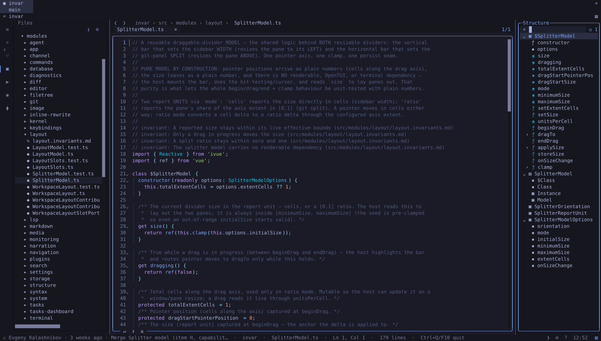

<p align="center">
  <a href="https://ivue.dev/">
    <picture>
      <source media="(prefers-color-scheme: dark)" srcset="docs_v2/public/brand-lockup-dark.png">
      
    </picture>
  </a>
</p>

<h3 align="center">Plain classes. Full reactivity.<br>Infinite scalability. One kilobyte.</h3>

<p align="center">
  <a href="https://www.npmjs.com/package/ivue"></a>
  <a href="https://www.npmjs.com/package/ivue"></a>
  <a href="https://github.com/infinite-system/ivue/actions/workflows/ci.yml"></a>
  
  
  <a href="./LICENSE"></a>
</p>

<p align="center">
  <a href="https://ivue.dev/">Docs</a> ·
  <a href="https://ivue.dev/guide/getting-started">Getting Started</a> ·
  <a href="https://ivue.dev/guide/standard">The Standard</a> ·
  <a href="https://ivue.dev/examples/">Examples</a> ·
  <a href="https://ivue.dev/guide/benchmarks">Benchmarks</a> ·
  <a href="https://ivue.dev/blog/">Blog</a> ·
  <a href="https://ivue.dev/community">Community</a>
</p>

---

ivue builds Vue 3 reactivity out of plain TypeScript classes. Real
inheritance, real encapsulation, real polymorphism — on ordinary objects,
with nothing paid until first access. The whole engine is **1.1 kB gzipped**
with zero dependencies.

```sh
npm i ivue vue
```

```ts
import { Reactive } from 'ivue';
import { ref } from 'vue';

class $Counter {
  get count() {
    return ref(0)
  }
  get double() {
    return this.count.value * 2 // plain getter — derives on read
  }
  increment() {
    this.count.value++
  }
}

export namespace Counter {
  export const $Class = $Counter; // raw — children `extends` this
  export let Class = Reactive($Class); // reactive — you `new` this
  export type Instance = typeof Class.Instance; // the unwrapping-surface type
}
```

```vue
<script setup lang="ts">
import { Counter } from './Counter';

const counter = new Counter.Class();

// the state destructure — every Ref the template touches, unwrapped uniformly
const { count } = counter;
</script>

<template>
  <button @click="counter.increment()">{{ count }} · double {{ counter.double }}</button>
</template>
```

Full walkthrough: [Getting Started](https://ivue.dev/guide/getting-started).

## Why classes, why now

- **Native class API** — `extends`, `super`, getters, setters, private
  fields. Real inheritance, encapsulation and polymorphism, all reactive.
- **Zero-cost creation** — instances are plain objects. A million of them
  take 22 ms — 6 to 132× faster than the alternatives.
- **One kilobyte** — 1.1 kB gzipped, zero dependencies, 100% test coverage.
  Stripped to the load-bearing core — an API you can hold in your head.
- **Store or ViewModel** — the same class serves as a global store, a
  component ViewModel, or a domain model. One mental model everywhere.
- **Composition API, fully compatible** — composables plug in through
  `$`-getters. The entire Vue ecosystem works inside your classes.
- **TypeScript first** — writable ref-getters, fully typed instances,
  precise inference. The type system shaped the engine's design.

## One idea, carried through

`Reactive()` transforms a class **once**. A getter returning `ref()` becomes
state: created on first touch, cached, stable forever. A plain getter stays
plain and re-derives on every read — reactive with zero allocation. Methods
bind themselves once, to the right `this`. Instances stay ordinary objects:
no proxy wraps them, no work happens at construction.

Inheritance, teardown, development parity, speed — consequences of that one
move. And composables plug straight in:

```ts
import { useMouse } from '@vueuse/core';

class $Pointer {
  private get $mouse() {
    return useMouse() // created once, encapsulated
  }
  get x() {
    return this.$mouse.x
  }
  get y() {
    return this.$mouse.y
  }
}
```

## Hard problems, solved together

Each of these sank earlier class-reactivity attempts. ivue ships all of them
as one coherent design:

- **Bound methods** — `this.method` is always correct, always the same reference.
- **Reactive inheritance** — deep `super.x.value` chains resolve level-safe.
- **Development parity** — the same class identity, direct binding, and engine branches in development and production.
- **[Circular import immunity](https://ivue.dev/blog/circular-imports-dissolved)** — the namespace pattern resolves mutual references in any load order.
- **Writable getter types** — ref-returning getters type as writable; instances fully inferred.
- **Deterministic teardown** — `$watch` scopes per instance, `$stopEffects()` cleans up.
- **Minimal memory footprint** — derivations are shared prototype getters, not per-instance allocations.
- **Hot paths** — reads hoist to native ref speed with one line where it matters.

## `Static()` — capability classes <sub>(`ivue/extras`, +0.5 kB)</sub>

The same discipline for the class-level surface:
[`Static()`](https://ivue.dev/guide/static) makes static methods lazy-bound
and `$`-prefixed static getters cached **per receiver** — a lazy singleton,
an inheritance-aware store, an override seam, and a test boundary in one
declaration. It retires
[module-level state](https://ivue.dev/blog/module-level-state) outright, and
it has no Vue dependency — the identical idiom runs under Node and Bun:

```ts
import { Static } from 'ivue/extras';

class $TextSegmentation {
  protected static get $segmenter() {
    return new Intl.Segmenter(undefined, { granularity: 'grapheme' });
  }
}

export namespace TextSegmentation {
  export const $Class = Static($TextSegmentation); // anchor — children extend this
  export let Class = $Class;
}
```

## Proven at scale

<p align="center">
  <a href="https://ivue.dev/examples/invar">
    
  </a>
</p>

[**Invar**](https://ivue.dev/examples/invar) is ivue at full scale: a
complete terminal IDE — editor, workspace search, git, terminals, LSP,
agents — running on ivue classes under Bun, with no DOM and no Vue
components. **94,000 source lines, 345 classes, 35 invariant contracts,
zero import cycles**, built almost entirely by AI agents holding the
[Standard](https://ivue.dev/guide/standard) as their base discipline.

And at the other end of scale on the web: a
[1,000,000-row virtual scroller](https://ivue.dev/examples/virtual-scroller),
a [20,000,000-cell flyweight grid](https://ivue.dev/examples/flyweight-grid)
at 4.7 bytes per live cell, and
[production-grade Quasar field components](https://ivue.dev/examples/choose-field) —
all with full source on the page.

## The numbers

Measured, not promised — every number carries its method, and the
load-bearing benchmarks
[run live in your browser](https://ivue.dev/guide/benchmarks) on the
shipped engine:

| creating 1,000,000 instances | time | ivue is |
| --- | --- | --- |
| **ivue `new Class()`** | **21.7 ms** | the baseline |
| composable factory | 139 ms | **6.4× faster** |
| native `reactive()` | 470 ms | **22× faster** |

| memory heap at 100,000 live instances | per instance | 100k total |
| --- | --- | --- |
| **ivue class, 30 getters** | **3.7 KB** | 364 MB |
| composable, 30 closures | 8.0 KB | 781 MB |
| `reactive()`, fields + getters | 10.4 KB | 1.02 GB |
| composable, 30 computeds | 19.7 KB | 1.93 GB |

Taken all the way down: a fully reactive spreadsheet model holding
**20,000,000 live cells at 4.7 bytes each** — 8.5× below the plain-object
floor — because in ivue, everything costs proportional to what's *observed*,
nothing costs proportional to what *exists*.

## Built for humans and AI

ivue ships with a
[Standard Operating Manual](https://ivue.dev/guide/standard) — the complete
authoring standard as annotated templates, rules, and a review checklist. It
reads as documentation and works as a drop-in skill for AI coding agents, so
generated code follows the same standard your team writes:

```sh
npx ivue skill        # installs .claude/skills/ivue/SKILL.md, version-locked
npx ivue skill --all  # + Codex/Cursor/Copilot where already in use
```

Agents holding the Standard have
[derived correct patterns its own author never wrote](https://ivue.dev/blog/patterns-the-author-never-wrote) —
the manual is a generator, not a catalog. The wider argument:
[Reactive framework for the AI era](https://ivue.dev/blog/reactive-framework-for-the-ai-era).

## Go deeper

- [Fundamental Principles](https://ivue.dev/guide/principles) — the design, from first ideas
- [The Engine](https://ivue.dev/engine) — how the transform works, internals annotated
- [Advanced Patterns](https://ivue.dev/guide/namespace-pattern) — Namespace, Computed Seed, Keyed Version Signals, Flyweight, Static, Backend ivue
- [The Blog](https://ivue.dev/blog/) — 30 posts of measured argument, from [circular imports](https://ivue.dev/blog/circular-imports-dissolved) to [what JavaScript becomes](https://ivue.dev/blog/what-javascript-becomes)

## Community

Questions, ideas, bug reports — there's no ticket queue, just the people who
write the code: [Discussions](https://github.com/infinite-system/ivue/discussions) ·
[Issues](https://github.com/infinite-system/ivue/issues) ·
[Discord](https://discord.gg/8MgZNsrfv) ·
[X @evgenykalash](https://x.com/evgenykalash) ·
[Community page](https://ivue.dev/community)

## A note on the size

The complete engine is **1.1 kB gzipped**: lazy prototype transformation,
bound methods, inheritance, lifecycle ownership, and the public utilities.
Development uses that same engine without a second hot-update execution path.

> *Perfection is achieved, not when there is nothing more to add, but when
> there is nothing left to take away.* — Antoine de Saint-Exupéry

## License

[MIT](./LICENSE)
